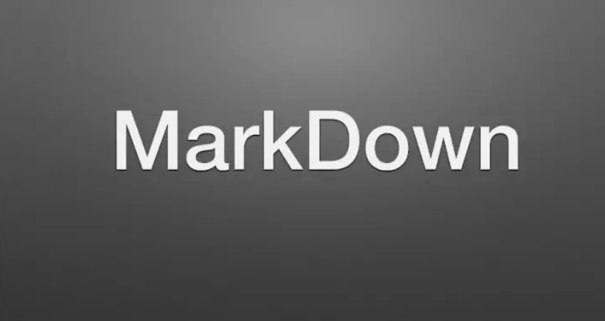

# Синтаксис языка Markdown. 

* Жирный текст — **

* Курсивный текст — *

* Зачеркнутый текст — ~

* Выделяют заголовки —# в начале строки

* Показать уровень заголовка —
подчеркивание знаками = или -

* Нумерованные Списки —
обозначаются обычными
цифрами 1, 2, 3

* Ненумерованные Списки —
обозначаются знаками *
в начале строки

* Вложенные Списки —
выполняем отступы

**Апострофы и кавычки**

* Если вы копируете текст из Word в редактор Markdown, он может содержать книжные (изогнутые) апострофы или кавычки. Их нужно заменить кодом или обычными апострофами или кавычками. В противном случае после публикации файла может отобразиться нечитаемый текст, например It’s.

*Ниже приведены кодировки для этих знаков пунктуации:*

* левая (открывающая) кавычка: “;
* правая (закрывающая) кавычка: ”;
* правая закрывающая одинарная кавычка или апостроф: ’;
* левая открывающая одинарная кавычка (используется редко): ‘.

* 

